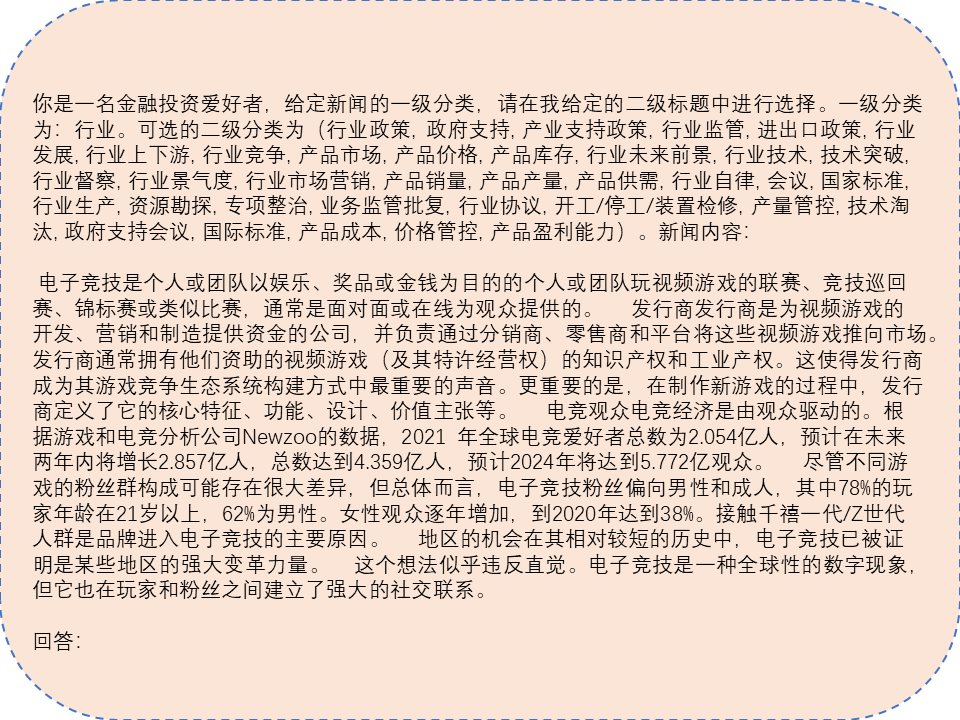

<div style="text-align:center">
<!--  -->
<h2>📈 CFBenchmark: Chinese Financial Assistant with Large Language Model</h2>
</div>

<div align="center">

<a href='https://arxiv.org/abs/2311.05812'></a> 
<a href=''></a> 


[English](README.md) | 简体中文

</div>

# 简介

欢迎来到**CFBenchmark**

近年来，随着大语言模型（LLM）的快速发展，现有的大语言模型在各项任务中都取得了优异的表现。 然而，我们注意到，目前专注于大语言模型在特定领域表现的基准测试数量有限。

由此，我们推出了CFBenchmark，这是一个旨在评估大语言模型在中文金融场景下辅助工作的基准评测。
CFBenchmark的基础版本包括3917个金融文本涵盖三个方面和八个任务。 
CFBenchmark从金融识别、金融分类、金融生成三个方面进行组织。 我们在 CFBenchmark 上以零样本和少样本模式进行实验，以评估市场上著名的大语言模型。 结果表明，大语言模型在金融文本处理的基本任务方面仍有很大的改进空间。

未来，我们还会继续更新这一系列，推出更多的基于中文语料库，金融领域的大语言模型基准测试。

<div align="center">
  
  <br />
  <br /></div>


# 目录

- [CFBenchmark-Basic](#cfbenchmark-basic)
- [快速开始](#快速开始)
- [测试结果](#测试结果)
- [致谢](#致谢)
- [未来的工作](#未来的工作)
- [许可证](#许可证)
- [引用](#引用)

# CFBenchmark-Basic

CFBenchmark的基础版本包括3917个金融文本涵盖三个方面和八个任务，从金融识别、金融分类、金融生成三个方面进行组织。
* 识别-公司：识别与财务文件相关的公司名称，共273个。
* 识别-产品：识别与财务文件相关的产品名称，共297个。
* 分类-情感分析：对于财务文件相关的情感类别进行分类，共591个。
* 分类-事件检测：对于财务文件相关的事件类别进行分类，共577个。
* 分类-行业确认：对于财务文件相关的二级行业进行分类，共402个。
* 生成-投资建议：基于提供的财务文件生成投资建议，共593个。
* 生成-风险提示：基于提供的财务文件生成投资建议，共591个。
* 生成-内容总结：基于提供的财务文件生成投资建议，共593个。

我们提供了两个模型，展示了零样本（Zero-shot）和少样本（Few-shot）是如何进行测试的。

样例1 少样本（Few-shot）的输入：
<div align="center">
  
  <br />
  <br /></div>

样例2 零样本（Zero-shot）的输入：
<div align="center">
  
  <br />
  <br /></div>

# 快速开始

## 安装

以下展示了一个安装的简单步骤。
 ```python
    conda create --name CFBenchmark python=3.10
    conda activate CFBenchmark
 ```

```python
    git clone https://github.com/TongjiFinLab/CFBenchmark
    cd CFBenchmark
    pip install -r requirements.txt
```

## 数据集准备

使用 Hugging Face 数据集下载数据集。 运行命令**手动下载**并解压，在CFBenchmark项目目录下运行以下命令,准备数据集到CFBenchmark/CFBenchmark目录下。

```text
wget https://huggingface.co/datasets/tongjiFinLab/CFBenchmark
unzip CFBenchmark.zip
```

## 测评
我们在 ```/codes``` 中为您准备了测试和评估代码。

为了运行测评，您可以在命令行中运行以下代码：

```cmd
cd CFBenchmark/codes
python -m run.py
```

您可以进入```codes/run.py```来修改其中的参数，让代码运行的路径符合您的要求。

```py
from CFBenchmark import CFBenchmark
if __name__=='__main__':

    # EXPERIMENT SETUP
    modelname = 'YOUR-MODEL-NAME'
    model_type= 'NORMAL' #NORMAL or LoRA
    model_path= 'YOUR-MODEL-PATH'
    peft_model_path= ''#PASS YOUR OWN PATH OF PEFT MODEL IF NEEDED
    fewshot_text_path= '../fewshot'#DEFAULT PATH
    test_type='few-shot'#LET'S TAKE THE FEW-SHOT TEST AS AN EXAMPLE
    response_path='../cfbenchmark-response'#PATH TO RESERVE THE RESPONSE OF YOUR MODEL
    scores_path='../cfbenchmark-scores'	#PATH TO RESERVE THE SCORE OF YOUR MODEL
    embedding_model_path='../bge-zh-v1.5' #PASS YOUR OWN PATH OF BGE-ZH-V1.5
    benchmark_path='../cfbenchmark' #DEFAULT PATH
    data_source_type='offline'#online or offline

    #generate Class CFBenchmark
    cfb=CFBenchmark(
        model_name=modelname,
        model_type=model_type,
        model_path=model_path,
        peft_model_path=peft_model_path,
        fewshot_text_path=fewshot_text_path,
        test_type=test_type,
        response_path=response_path,
        scores_path=scores_path,
        embedding_model_path=embedding_model_path,
        benchmark_path=benchmark_path,
        data_source_type=data_source_type
    )
    
    cfb.generate_model()# TO GET RESPONSE FROM YOUR MODEL
    cfb.get_test_scores()# TO GET YOUR MODEL SCORES FROM RESPONSE
```


我们在```codes/CFBenchmark.py```中定义了一个类“CFBenchmark”来进行评估。

```Py
class CFBenchmark:
    def __init__(self,
                 model_name,
                 model_type,
                 model_path,
                 peft_model_path,
                 fewshot_text_path,
                 test_type,
                 response_path,
                 scores_path,
                 embedding_model_path,
                 benchmark_path,
                 data_source_type
                 ) -> None:
```
* 您可以使用参数来设置模型的路径。 如果你想使用进行LoRA微调后的模型，请将``model_type``设置为````LoRA````并通过````peft_model_path```传递你的peft模型路径。
* 您可以将``test-type``设置为'zero-shot'或'few-shot'来进行不同的评估。
* 为“bzh-zh-v1.5”设置“embedding_model_path”，用于计算余弦相似度。
* 您可以修改“CFBenchmark.generate_model()”中的超参数来生成文本。
* 我们在Hugging Face和Github中都提供了保存为Dataset数据类型的CFBenchmark。如果您想使用离线版本的基准，将参数```data_source_type```设置为```offline```。如果您想使用在线版本的基准，将参数```data_source_type```设置为```online```。

# 测试结果

我们使用两种类型的指标来评估金融领域大语言模型在 CFBenchmark 上的表现。
对于识别和分类任务，我们采用 **F1_score** 作为评估指标，平衡了精度和召回率。 对于生成任务，我们利用地面实况的向量表示和生成的答案之间的**余弦相似度**来衡量生成能力。 由于在我们的生成任务中通常存在具有相似含义的不同表达，因此简单地使用 Rough-Score 或 BULE-socre 是不合理的。 具体来说，指定**bge-zh-v1.5**作为oracle模型来生成句子嵌入。 我们单独计算每个子任务的评估分数，并提供每个类别的平均分数。

大语言模型的最佳分数（考虑零样本和少样本）以及我们的模型的最佳分数如下所示：
| Model              | Size | Company | Product | R.Avg   | Sector | Event   | Sentiment | C.Avg   | Summary | Risk    | Suggestion | G.Avg   | Avg     |
| ------------------ | ---- | ------- | ------- | -----   | -------- | -----   | --------- | -----   | ------- | -----   | ---------- | -----   | -----   |
| ChatGPT            | 20B  | 0.797   | 0.198   | 0.498   | 0.453    | 0.458   | 0.425     | 0.455   | 0.593   | 0.541   | 0.771      | 0.635   | 0.529   |
| ERNIE-Bot          | 260B | 0.807   | 0.300   | 0.533   | 0.408    | 0.350   | 0.186     | 0.315   | 0.715   | 0.590   | 0.716      | 0.673   | 0.507   |
| ERNIE-Bot-4        | -    | 0.819   | 0.417   | 0.618   | 0.418    | 0.358   | 0.375     | 0.384   | 0.721   | 0.629   | 0.718      | 0.689   | 0.564   |
| Falcon-7B          | 7B   | 0.671   | 0.168   | 0.420   | 0.169    | 0.132   | 0.250     | 0.184   | 0.302   | 0.301   | 0.246      | 0.283   | 0.296   |
| Falcon-7B-chat     | 7B   | 0.582   | 0.046   | 0.314   | 0.112    | 0.142   | 0.153     | 0.135   | 0.307   | 0.299   | 0.258      | 0.288   | 0.246   |
| bloomz-7B1         | 7B   | 0.765   | 0.166   | 0.465   | 0.252    | 0.154   | 0.394     | 0.267   | 0.451   | 0.371   | 0.462      | 0.428   | 0.387   |
| bloomz-7Bt1-mt     | 7B   | 0.751   | 0.157   | 0.454   | 0.087    | 0.182   | 0.380     | 0.216   | 0.425   | 0.379   | 0.396      | 0.400   | 0.357   |
| Qwen-7B            | 7B   | 0.780   | 0.357   | 0.569   | 0.480    | 0.335   | 0.379     | 0.398   | 0.750   | 0.505   | 0.713      | 0.656   | 0.541   |
| Qwen-Chat-7B       | 7B   | 0.763   | 0.360   | 0.562   | 0.400    | 0.367   | 0.265     | 0.344   | 0.548   | 0.307   | 0.379      | 0.411   | 0.439   |
| Qwen-14B           | 14B  | 0.805   | 0.421   | 0.613   | 0.481    | 0.350   | 0.385     | 0.405   | 0.754   | 0.608   | 0.717      | 0.693   | 0.570   |
| Qwen-Chat-14B      | 14B  | 0.814   | 0.442   | 0.628   | 0.382    | 0.400   | 0.350     | 0.377   | 0.732   | 0.478   | 0.736      | 0.649   | 0.551   |
| ChatGLM2-6B        | 6B   | 0.747   | 0.313   | 0.530   | 0.285    | 0.300   | 0.357     | 0.314   | 0.657   | 0.454   | 0.671      | 0.594   | 0.479   |
| Baichuan2-7B-Base  | 7B   | 0.672   | 0.340   | 0.506   | 0.342    | 0.490   | 0.480     | 0.437   | 0.739   | 0.619   | 0.751      | 0.703   | 0.549   |
| Baichuan2-7B-Chat  | 7B   | 0.757   | 0.402   | 0.579   | 0.425    | 0.475   | 0.323     | 0.408   | 0.725   | 0.648   | 0.732      | 0.702   | 0.563   |
| Baichuan2-13B-Base | 13B  | 0.781   | 0.330   | 0.555   | 0.436    | 0.496   | 0.477     | 0.470   | 0.725   | 0.503   | 0.747      | 0.658   | 0.561   |
| Baichuan2-13B-Chat | 13B  | 0.797   | 0.314   | 0.556   | 0.472    | 0.507   | 0.387     | 0.455   | 0.739   | 0.634   | 0.746      | 0.706   | 0.572   |
| InternLM-7B        | 7B   | 0.612   | 0.233   | 0.423   | 0.266    | 0.311   | 0.328     | 0.302   | 0.378   | 0.336   | 0.379      | 0.364   | 0.363   |
| InternLM-7B-Chat   | 7B   | 0.632   | 0.261   | 0.447   | 0.272    | 0.364   | 0.399     | 0.345   | 0.363   | 0.270   | 0.353      | 0.329   | 0.374   |
| InternLM-20B       | 20B  | 0.809   | 0.358   | 0.583   | 0.500    | 0.427   | 0.417     | 0.448   | 0.706   | 0.653   | 0.728      | 0.695   | 0.575   |
| InternLM-20B-Chat  | 20B  | 0.488   | 0.362   | 0.425   | 0.323    | 0.327   | 0.370     | 0.340   | 0.706   | 0.578   | 0.762      | 0.662   | 0.476   |
| CFGPT1-stf-LoRA    | 7B   | 0.820   | 0.414   | 0.617   | 0.569    | 0.729   | 0.769     | 0.689   | 0.745   | 0.584   | 0.609      | 0.646   | 0.650   |
| CFGPT1-sft-Full    | 7B   |**0.836**|**0.476**|**0.656**|**0.700** |**0.808**|**0.829**  |**0.779**|**0.798**|**0.669**|**0.808**   |**0.758**|**0.731**|


# 致谢
CFBenchmark 参考了以下开源项目。 我们想向这些项目的研究人员表示感谢和尊重。
- tiiuae/falcon LLM series(https://huggingface.co/tiiuae/falcon-7b)
- bigscience/bloomz LLM series(https://huggingface.co/bigscience/bloomz-7b1)
- QwenLM/Qwen LLM series(https://github.com/QwenLM/Qwen)
- THUDM/ChatGLM2-6b(https://github.com/THUDM/ChatGLM2-6B)
- baichuan-inc/Baichuan2 LLM series(https://github.com/baichuan-inc/Baichuan2)
- InternLM/InternLM LLM series(https://github.com/InternLM/InternLM)
- ssymmetry/BBT-FinCUGE-Applications(https://github.com/ssymmetry/BBT-FinCUGE-Applications)
- chancefocus/PIXIU(https://github.com/chancefocus/PIXIU)
- SUFE-AIFLM-Lab/FinEval(https://github.com/SUFE-AIFLM-Lab/FinEval)
CFBenchmark受到[XXX](https://xxx)的支持。

# 未来的工作
- [ ] 针对中文金融使用中各种场景，提出更多的评测任务，丰富CFBenchmark系列基准。

# 许可证
CFBenchmark是一项研究预览，仅供非商业使用，受OpenAI生成数据的使用条款约束。如果您发现任何潜在的违规行为，请与我们联系。该代码发布在Apache License 2.0下。

# 引用

```bibtex
@misc{lei2023cfbenchmark,
      title={{CFBenchmark}: Chinese Financial Assistant Benchmark for Large Language Model}, 
      author={Lei, Yang and Li, Jiangtong and Jiang, Ming and Hu, Junjie and Cheng, Dawei and Ding, Zhijun and Jiang, Changjun},
      year={2023},
      eprint={2311.05812},
      archivePrefix={arXiv},
      primaryClass={cs.CL}
}
```

