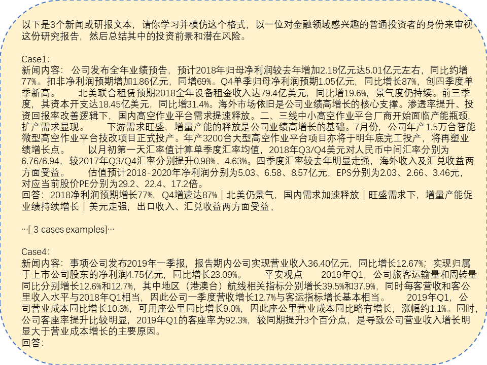

<div style="text-align:center">
<!--  -->
<h2>📈 CFBenchmark: Chinese Financial Assistant with Large Language Model</h2>
</div>

<div align="center">

<a href='https://arxiv.org/abs/2311.05812'></a> 
<a href='https://huggingface.co/datasets/TongjiFinLab/CFBenchmark'></a> 


[English](README.md) | 简体中文

</div>

# 简介

欢迎来到**CFBenchmark**

近年来，随着大语言模型（LLM）的快速发展，现有的大语言模型在各项任务中都取得了优异的表现。 然而，我们注意到，目前专注于大语言模型在特定领域表现的基准测试数量有限。

“书生•济世”中文金融评测基准（CFBenchmark）基础版本由[CFBenchmark-Basic](https://huggingface.co/datasets/TongjiFinLab/CFBenchmark)和[OpenFinData](https://github.com/open-compass/OpenFinData)两部分数据组成，主要包含以下几方面，来评测相关大模型在金融实际应用中的各项能力和安全性：
* 金融自然语言处理，主要关注模型对金融文本的理解和生成能力，如金融实体识别，行业分类，研报总结和风险评估；
* 金融场景计算，侧重于评估模型在特定金融场景下的计算和推理能力，如风险评估和投资组合优化；
* 金融分析与解读任务，检验模型在理解复杂金融报告、预测市场趋势和辅助决策制定方面的能力；
* 金融合规与安全检查，评估模型潜在的合规风险，如生成内容的隐私性、内容安全性、金融合规性等方面的能力。

未来，“书生•济世”中文金融评测基准将继续深化金融大模型评测体系建设，包括大模型在金融行业应用过程中的模型生成内容的准确性、及时性、安全性、隐私性、合规性等能力评估。

<div align="center">
  
  <br />
  <br /></div>

# 更新

\[2024.03.17\] 增加了在金融数据集[OpenFinData](https://github.com/open-compass/OpenFinData)上的评测内容，提供了该数据集中对应主观题的一种评测代码实现方式，并测试了9个大模型在[OpenFinData](https://github.com/open-compass/OpenFinData) 数据集上的评测结果。

>  [OpenFinData](https://github.com/open-compass/OpenFinData)数据来源于东方财富与上海人工智能实验室联合发布的开源项目，更多详情：[Github地址](https://github.com/open-compass/opencompass/blob/main/configs/datasets/OpenFinData/OpenFinData.md)。

\[2023.11.10\] 我们发布了[CFBenchmark-Basic](https://huggingface.co/datasets/TongjiFinLab/CFBenchmark)和对应的[技术报告](https://arxiv.org/abs/2311.05812)，主要针对大模型在金融自然语言任务和金融文本生成任务上的能力进行全面评测。

# 目录

- [CFBenchmark-Basic](#cfbenchmark-basic)
- [快速开始](#快速开始)
- [测试结果](#测试结果)
- [致谢](#致谢)
- [未来的工作](#未来的工作)
- [许可证](#许可证)
- [引用](#引用)

# CFBenchmark-Basic

CFBenchmark的基础版本包括3917个金融文本涵盖三个方面和八个任务，从金融识别、金融分类、金融生成三个方面进行组织。
* 识别-公司：识别与财务文件相关的公司名称，共273个。
* 识别-产品：识别与财务文件相关的产品名称，共297个。
* 分类-情感分析：对于财务文件相关的情感类别进行分类，共591个。
* 分类-事件检测：对于财务文件相关的事件类别进行分类，共577个。
* 分类-行业确认：对于财务文件相关的二级行业进行分类，共402个。
* 生成-投资建议：基于提供的财务文件生成投资建议，共593个。
* 生成-风险提示：基于提供的财务文件生成投资建议，共591个。
* 生成-内容总结：基于提供的财务文件生成投资建议，共593个。

我们提供了两个模型，展示了零样本（Zero-shot）和少样本（Few-shot）是如何进行测试的。

样例1 少样本（Few-shot）的输入：
<div align="center">
  
  <br />
  <br /></div>

样例2 零样本（Zero-shot）的输入：
<div align="center">
  
  <br />
  <br /></div>

# 快速开始

## 安装

以下展示了一个安装的简单步骤。
 ```python
    conda create --name CFBenchmark python=3.10
    conda activate CFBenchmark
 ```

```python
    git clone https://github.com/TongjiFinLab/CFBenchmark
    cd CFBenchmark
    pip install -r requirements.txt
```

## 数据集准备

使用 Hugging Face 数据集下载数据集。 运行命令**手动下载**并解压，在CFBenchmark项目目录下运行以下命令,准备数据集到CFBenchmark/CFBenchmark目录下。

```text
wget https://huggingface.co/datasets/tongjiFinLab/CFBenchmark
unzip CFBenchmark.zip
```

## 测评

### CFBenchmark-Basic

我们在 ```/codes``` 中为您准备了测试和评估代码。

为了运行测评，您可以在命令行中运行以下代码：

```cmd
cd CFBenchmark/codes
python -m run.py
```

您可以进入```codes/run.py```来修改其中的参数，让代码运行的路径符合您的要求。

```py
from CFBenchmark import CFBenchmark
if __name__=='__main__':

    # EXPERIMENT SETUP
    modelname = 'YOUR-MODEL-NAME'
    model_type= 'NORMAL' #NORMAL or LoRA
    model_path= 'YOUR-MODEL-PATH'
    peft_model_path= ''#PASS YOUR OWN PATH OF PEFT MODEL IF NEEDED
    fewshot_text_path= '../fewshot'#DEFAULT PATH
    test_type='few-shot'#LET'S TAKE THE FEW-SHOT TEST AS AN EXAMPLE
    response_path='../cfbenchmark-response'#PATH TO RESERVE THE RESPONSE OF YOUR MODEL
    scores_path='../cfbenchmark-scores' #PATH TO RESERVE THE SCORE OF YOUR MODEL
    embedding_model_path='../bge-zh-v1.5' #PASS YOUR OWN PATH OF BGE-ZH-V1.5
    benchmark_path='../cfbenchmark' #DEFAULT PATH
    data_source_type='offline'#online or offline

    #generate Class CFBenchmark
    cfb=CFBenchmark(
        model_name=modelname,
        model_type=model_type,
        model_path=model_path,
        peft_model_path=peft_model_path,
        fewshot_text_path=fewshot_text_path,
        test_type=test_type,
        response_path=response_path,
        scores_path=scores_path,
        embedding_model_path=embedding_model_path,
        benchmark_path=benchmark_path,
        data_source_type=data_source_type
    )
    
    cfb.generate_model()# TO GET RESPONSE FROM YOUR MODEL
    cfb.get_test_scores()# TO GET YOUR MODEL SCORES FROM RESPONSE
```

我们在```codes/CFBenchmark.py```中定义了一个类“CFBenchmark”来进行评估。

```Py
class CFBenchmark:
    def __init__(self,
                 model_name,
                 model_type,
                 model_path,
                 peft_model_path,
                 fewshot_text_path,
                 test_type,
                 response_path,
                 scores_path,
                 embedding_model_path,
                 benchmark_path,
                 data_source_type
                 ) -> None:
```
* 您可以使用参数来设置模型的路径。 如果你想使用进行LoRA微调后的模型，请将``model_type``设置为````LoRA````并通过````peft_model_path```传递你的peft模型路径。
* 您可以将``test-type``设置为'zero-shot'或'few-shot'来进行不同的评估。
* 为“bzh-zh-v1.5”设置“embedding_model_path”，用于计算余弦相似度。
* 您可以修改“CFBenchmark.generate_model()”中的超参数来生成文本。
* 我们在Hugging Face和Github中都提供了保存为Dataset数据类型的CFBenchmark。如果您想使用离线版本的基准，将参数```data_source_type```设置为```offline```。如果您想使用在线版本的基准，将参数```data_source_type```设置为```online```。

### OpenFinData

我们在```./OpenFinData``` 中为您准备了测试和评估的代码与数据。
评测代码的设计与Fineva1.0相似，通过```./OpenFinData/src/evaluator```对于评测模型的调用方式进行定义，并通过```OpenFinData/run_scripts```中的bash文件对于关键参数进行配置和实验。

为了运行测评，您可以在命令行中运行以下代码：

```cmd
cd CFBenchmark/OpenFinData/run_scripts
sh run_baichuan2_7b.sh
```

值得注意的是，因为OpenFinData的评测过程涉及主观题的判断，因此我们的评测框架借助了文心一言来对金融解读与分析类问题和金融合规类问题进行评测。为了顺利试用文心一言的API参与评测，请您在环境变量中设置```BAIDU_API_KEY```和```BAIDU_SECRET_KEY```，以便于```./OpenFinData/src/get_score.py```的```get_access_token```函数可以顺利运行。

```Py
def get_access_token():
    """
    使用 API Key，Secret Key 获取access_token，替换下列示例中的应用API Key、应用Secret Key
    """

    url = "https://aip.baidubce.com/oauth/2.0/token?grant_type=client_credentials&client_id={}&client_secret={}".format(os.environ.get("BAIDU_API_KEY"), os.environ.get("BAIDU_SECRET_KEY"))
    
    payload = json.dumps("")
    headers = {
        'Content-Type': 'application/json',
        'Accept': 'application/json'
    }
    
    response = requests.request("POST", url, headers=headers, data=payload)
    return response.json().get("access_token")
```


# 测试结果

我们使用两种类型的指标来评估金融领域大语言模型在 CFBenchmark 上的表现。
对于识别和分类任务，我们采用 **F1_score** 作为评估指标，平衡了精度和召回率。 对于生成任务，我们利用地面实况的向量表示和生成的答案之间的**余弦相似度**来衡量生成能力。 由于在我们的生成任务中通常存在具有相似含义的不同表达，因此简单地使用 Rough-Score 或 BULE-socre 是不合理的。 具体来说，指定**bge-zh-v1.5**作为oracle模型来生成句子嵌入。 我们单独计算每个子任务的评估分数，并提供每个类别的平均分数。


## CFBenchmark-Basic
| Model              | Size | Company   | Product   | R.Avg     | Sector    | Event     | Sentiment | C.Avg     | Summary   | Risk      | Suggestion | G.Avg     | Avg       |
| ------------------ | ---- | --------- | --------- | --------- | --------- | --------- | --------- | --------- | --------- | --------- | ---------- | --------- | --------- |
| HUMAN              | -    | 0.931     | 0.744     | 0.838     | 0.975     | 0.939     | 0.912     | 0.942     | 1.000     | 1.000     | 1.000      | 1.000     | 0.927     |
| ChatGPT            | 20B  | 0.797     | 0.198     | 0.498     | 0.453     | 0.458     | 0.425     | 0.455     | 0.593     | 0.541     | 0.771      | 0.635     | 0.529     |
| ERNIE-Bot          | 260B | 0.807     | 0.300     | 0.533     | 0.408     | 0.350     | 0.186     | 0.315     | 0.715     | 0.590     | 0.716      | 0.673     | 0.507     |
| ERNIE-Bot-4        | -    | 0.819     | 0.417     | 0.618     | 0.418     | 0.358     | 0.375     | 0.384     | 0.721     | 0.629     | 0.718      | 0.689     | 0.564     |
| Falcon-7B          | 7B   | 0.671     | 0.168     | 0.420     | 0.169     | 0.132     | 0.250     | 0.184     | 0.302     | 0.301     | 0.246      | 0.283     | 0.296     |
| Falcon-7B-chat     | 7B   | 0.582     | 0.046     | 0.314     | 0.112     | 0.142     | 0.153     | 0.135     | 0.307     | 0.299     | 0.258      | 0.288     | 0.246     |
| bloomz-7B1         | 7B   | 0.765     | 0.166     | 0.465     | 0.252     | 0.154     | 0.394     | 0.267     | 0.451     | 0.371     | 0.462      | 0.428     | 0.387     |
| bloomz-7Bt1-mt     | 7B   | 0.751     | 0.157     | 0.454     | 0.087     | 0.182     | 0.380     | 0.216     | 0.425     | 0.379     | 0.396      | 0.400     | 0.357     |
| Qwen-7B            | 7B   | 0.780     | 0.357     | 0.569     | 0.480     | 0.335     | 0.379     | 0.398     | 0.750     | 0.505     | 0.713      | 0.656     | 0.541     |
| Qwen-Chat-7B       | 7B   | 0.763     | 0.360     | 0.562     | 0.400     | 0.367     | 0.265     | 0.344     | 0.548     | 0.307     | 0.379      | 0.411     | 0.439     |
| Qwen-14B           | 14B  | 0.805     | 0.421     | 0.613     | 0.481     | 0.350     | 0.385     | 0.405     | 0.754     | 0.608     | 0.717      | 0.693     | 0.570     |
| Qwen-Chat-14B      | 14B  | 0.814     | 0.442     | 0.628     | 0.382     | 0.400     | 0.350     | 0.377     | 0.732     | 0.478     | 0.736      | 0.649     | 0.551     |
| ChatGLM2-6B        | 6B   | 0.747     | 0.313     | 0.530     | 0.285     | 0.300     | 0.357     | 0.314     | 0.657     | 0.454     | 0.671      | 0.594     | 0.479     |
| Baichuan2-7B-Base  | 7B   | 0.672     | 0.340     | 0.506     | 0.342     | 0.490     | 0.480     | 0.437     | 0.739     | 0.619     | 0.751      | 0.703     | 0.549     |
| Baichuan2-7B-Chat  | 7B   | 0.757     | 0.402     | 0.579     | 0.425     | 0.475     | 0.323     | 0.408     | 0.725     | 0.648     | 0.732      | 0.702     | 0.563     |
| Baichuan2-13B-Base | 13B  | 0.781     | 0.330     | 0.555     | 0.436     | 0.496     | 0.477     | 0.470     | 0.725     | 0.503     | 0.747      | 0.658     | 0.561     |
| Baichuan2-13B-Chat | 13B  | 0.797     | 0.314     | 0.556     | 0.472     | 0.507     | 0.387     | 0.455     | 0.739     | 0.634     | 0.746      | 0.706     | 0.572     |
| InternLM-7B        | 7B   | 0.612     | 0.233     | 0.423     | 0.266     | 0.311     | 0.328     | 0.302     | 0.378     | 0.336     | 0.379      | 0.364     | 0.363     |
| InternLM-7B-Chat   | 7B   | 0.632     | 0.261     | 0.447     | 0.272     | 0.364     | 0.399     | 0.345     | 0.363     | 0.270     | 0.353      | 0.329     | 0.374     |
| InternLM-20B       | 20B  | 0.809     | 0.358     | 0.583     | 0.500     | 0.427     | 0.417     | 0.448     | 0.706     | 0.653     | 0.728      | 0.695     | 0.575     |
| InternLM-20B-Chat  | 20B  | 0.488     | 0.362     | 0.425     | 0.323     | 0.327     | 0.370     | 0.340     | 0.706     | 0.578     | 0.762      | 0.662     | 0.476     |
| CFGPT1-stf-LoRA    | 7B   | 0.820     | 0.414     | 0.617     | 0.569     | 0.729     | 0.769     | 0.689     | 0.745     | 0.584     | 0.609      | 0.646     | 0.650     |
| CFGPT1-sft-Full    | 7B   | **0.836** | **0.476** | **0.656** | **0.700** | **0.808** | **0.829** | **0.779** | **0.798** | **0.669** | **0.808**  | **0.758** | **0.731** |
| CFGPT2-7B          | 7B   | **0.834** | **0.470** | **0.652** | **0.644** | **0.750** | **0.793** | **0.729** | **0.801** | **0.692** | **0.790**  | **0.761** | **0.714** |
| CFGPT2-20B         | 20B  | **0.891** | **0.501** | **0.696** | **0.722** | **0.825** | **0.865** | **0.806** | **0.825** | **0.727** | **0.823**  | **0.792** | **0.755** |

## OpenFinData

| Model              | Size | Knowledge | Caluation | Explanation | Identification | Analysis | Compliance | Average | 
| ------------------ | ---- | -------   | ------    | -----       | ---------      | -----    | -------    | -----   |
| ERNIE-Bot-3.5      | -    | 78.0      | 70.4      | 82.1        | 75.3           | 77.7     | 36.7       | 70.0    | 
| ERNIE-Bot-4        | -    | **87.3**  | **73.6**  | **84.3**    | **77.0**       | **79.1** | 37.3       |**73.1** | 
| InternLM-7B        | 7B   | 65.3      | 45.8      | 71.4        | 62.5           | 59.2     | 37.2       | 56.9    | 
| ChatGLM2-6B        | 6B   | 62.4      | 37.2      | 70.8        | 59.2           | 58.3     | 38.7       | 54.4    | 
| Qwen-Chat-7B       | 7B   | 71.3      | 40.5      | 71.4        | 58.6           | 51.3     | 40.0       | 55.5    | 
| Qwen-Chat-14B      | 14B  | 78.0      | 57.6      | 75.6        | 71.6           | 59.3     | 40.6       | 63.8    | 
| Baichuan2-7B-Chat  | 7B   | 46.2      | 37.0      | 76.5        | 60.2           | 55.0     | 28.7       | 50.6    | 
| Baichuan2-13B-Chat | 13B  | 69.3      | 39.5      | 75.3        | 65.7           | 62.0     | 31.3       | 57.2    | 
| InternLM2-7B       | 7B   | 70.2      | 39.9      | 73.4        | 62.8           | 61.4     | 39.5       | 57.8    |
| InternLM2-20B      | 20B  | 76.4      | 52.6      | 76.3        | 66.2           | 63.9     | 42.1       | 62.9    |
| CFGPT2-7B          | 7B   | 81.9      | 62.8      | 75.2        | 71.3           | 64.1     | 68.2       | 70.5    |
| CFGPT2-20B         | 20B  | 84.6      | 66.5      | 78.1        | 75.9           | 66.0     | **71.9**   | 73.8    |


# 致谢
CFBenchmark 研发过程中参考了以下开源项目。 我们向项目的研究人员表示感谢。
- tiiuae/falcon LLM series(https://huggingface.co/tiiuae/falcon-7b)
- bigscience/bloomz LLM series(https://huggingface.co/bigscience/bloomz-7b1)
- QwenLM/Qwen LLM series(https://github.com/QwenLM/Qwen)
- THUDM/ChatGLM2-6b(https://github.com/THUDM/ChatGLM2-6B)
- baichuan-inc/Baichuan2 LLM series(https://github.com/baichuan-inc/Baichuan2)
- InternLM/InternLM LLM series(https://github.com/InternLM/InternLM)
- ssymmetry/BBT-FinCUGE-Applications(https://github.com/ssymmetry/BBT-FinCUGE-Applications)
- chancefocus/PIXIU(https://github.com/chancefocus/PIXIU)
- SUFE-AIFLM-Lab/FinEval(https://github.com/SUFE-AIFLM-Lab/FinEval)
- alipay/financial_evaluation_dataset(https://github.com/alipay/financial_evaluation_dataset)
- open-compass/OpenFinData(https://github.com/open-compass/OpenFinData)
- QwenLM/Qwen(https://github.com/QwenLM/Qwen)

# 未来的工作
- [ ] 针对中文金融使用中各种场景，提出更多的评测任务，丰富CFBenchmark系列基准。

# 许可证
CFBenchmark是一项研究预览，受OpenAI生成数据的使用条款约束。如果您发现任何潜在的风险行为，请与我们联系。该代码发布在Apache License 2.0下。

### 感谢我们的贡献者 ：
<a href="https://github.com/TongjiFinLab/CFBenchmark/graphs/contributors">
  
</a>

# 引用

```bibtex
@misc{lei2023cfbenchmark,
      title={{CFBenchmark}: Chinese Financial Assistant Benchmark for Large Language Model}, 
      author={Lei, Yang and Li, Jiangtong and Cheng, Dawei and Ding, Zhijun and Jiang, Changjun},
      year={2023},
      eprint={2311.05812},
      archivePrefix={arXiv},
      primaryClass={cs.CL}
}
```

