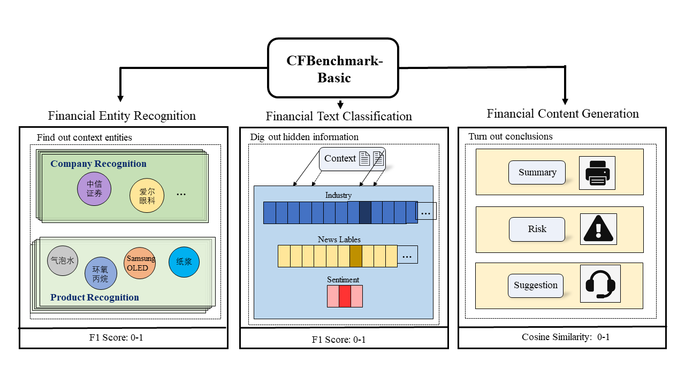
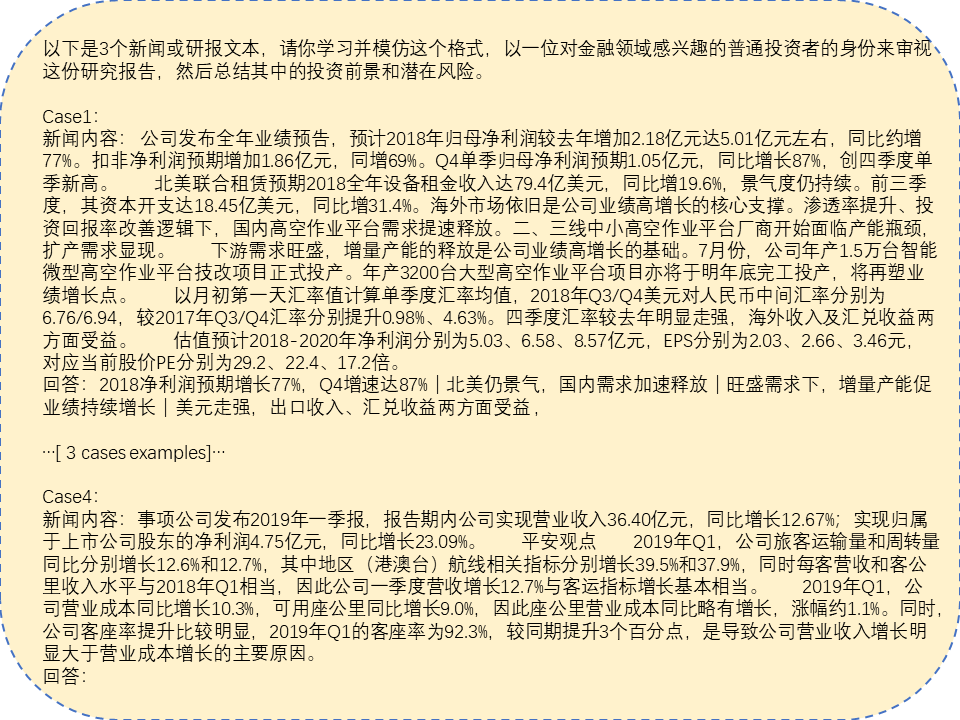
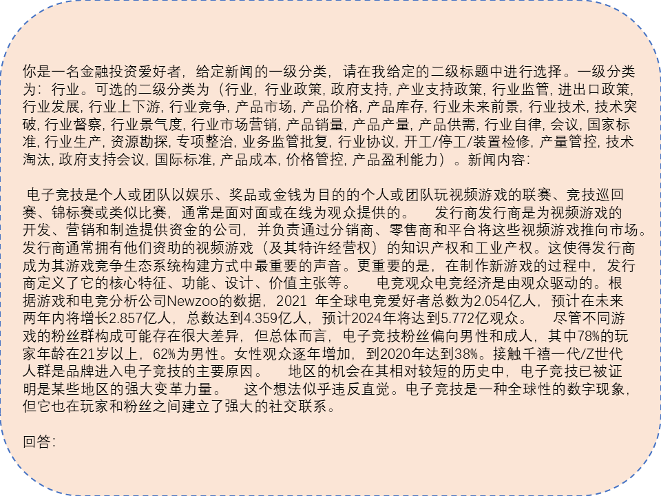

<div style="text-align:center">
<!--  -->
<h2>📈 CFBenchmark: Chinese Financial Assistant Benchmark for Large Language Model</h2>
</div>

<div align="left">
<a href='https://arxiv.org/abs/2311.05812'></a> 
<a href='https://huggingface.co/datasets/TongjiFinLab/CFBenchmark'></a>  
<a href=''></a>  
</div>

English | [简体中文](README-CN.md)


# Introduction

Welcome to **CFBenchmark**

In recent years, with the rapid development of Large Language Models~(LLMs), outstanding performance has been achieved in various tasks by existing LLMs. However, we notice that there is currently a limited amount of benchmarks focused on assessing the performance of LLMs in specific domains. 

The "InternLM·JiShi" Chinese Financial Evaluation Benchmark (CFBenchmark) basic version consists of data from [CFBenchmark-Basic](https://huggingface.co/datasets/TongjiFinLab/CFBenchmark) and [CFBenchmark-OpenFinData](https://github.com/open-compass/OpenFinData), focusing on evaluating the capabilities and safety of related large models in practical financial applications in the following aspects:
* Financial Natural Language Processing, mainly focusing on the model's understanding and generation capabilities of financial texts, such as financial entity recognition, industry classification, research report summarization, and risk assessment;
* Financial Scenario Calculation, focusing on assessing the model's calculation and reasoning capabilities in specific financial scenarios, such as risk assessment and investment portfolio optimization;
* Financial Analysis and Interpretation Tasks, testing the model's ability to understand complex financial reports, predict market trends, and assist in decision-making;
* Financial Compliance and Security Checks, assessing the model's potential compliance risks, such as the privacy, content safety, and financial compliance capabilities of generated content.

In the future, the "InternLM·JiShi" Chinese Financial Evaluation Benchmark will continue to deepen the construction of the financial big model evaluation system, including assessing the accuracy, timeliness, safety, privacy, and compliance of the model-generated content in the financial industry application process.


<div align="center">
  
  <br />
  <br /></div>

# News

[2024.03.17] Added the evaluation on the financial dataset [CFBenchmark-OpenFinData](https://github.com/open-compass/OpenFinData) and released an implementation of the evaluation of the subjective questions in this dataset. In addition, we also reported the test results of 9 LLMs on the OpenFinData dataset.

> [OpenFinData](https://github.com/open-compass/OpenFinData) is publicly released by EastMoney.com and Shanghai AI Lab. See details  [Github](https://github.com/open-compass/opencompass/blob/main/configs/datasets/OpenFinData/OpenFinData.md).

[2023.11.10] We released [CFBenchmark-Basic](https://huggingface.co/datasets/TongjiFinLab/CFBenchmark) and the corresponding [technical report](https://arxiv.org/abs/2311.05812), mainly focusing on a comprehensive evaluation of large models in financial natural language tasks and financial text generation tasks.

# Contents

- [CFBenchmark-Basic](#cfbenchmark-basic)
- [QuickStart](#QuickStart)
- [Performance of Existing LLMs](#performance-of-existing-llms)
- [Acknowledgements](#acknowledgements)
- [To-Do](#to-do)
- [License](#license)
- [Citation](#citation) 

# CFBenchmark-Basic

CFBenchmark-Basic includes 3917 financial texts spanning three aspects and eight tasks, organized from three aspects, financial recognition, financial classification, and financial generation.

- Recognition-Company: Recognize the company names associated with financial documents (273).
- Recognition-Product: Recognize the product names associated with financial documents (297).
- Classification-Sentiment: Classify the sentiment associated with financial documents (591).
- Classification-Event: Classify the event categories associated with financial documents (577).
- Classification-Industry: Classify the industry categories associated with financial documents (402).
- Generation-Suggestion: Generate investment suggestions based on the provided financial document (593).
- Generation-Risk: Generate risk alerts based on the provided financial document (591).
- Generation-Summary: Generate a content summary based on the provided financial document (593).

We provide two examples to reveal how the few-shot setting and zero-shot setting work during evaluation.

Example 1 Fewshot Input:
<div align="center">
  
  <br />
  <br /></div>

Example 2 Zeroshot Input：
<div align="center">
  
  <br />
  <br /></div>

# QuickStart

## Installation

Below are the steps for quick installation.

 ```python
    conda create --name CFBenchmark python=3.10
    conda activate CFBenchmark
 ```

```python
    git clone https://github.com/TongjiFinLab/CFBenchmark
    cd CFBenchmark
    pip install -r requirements.txt
```

## Evaluation

### CFBenchmark-Basic

We have prepared the testing and evaluation codes for you in repo ```CFBenchmark-Basic/src```.  

To begin the evaluation, you can run the following code from the command line:
```cmd
cd CFBenchmark-Basic/src
python -m run.py
```
You can enter ```CFBenchmark-Basic/src/run.py``` to modify the parameters in it to make the code running path meet your requirements.
```py
from CFBenchmark import CFBenchmark
if __name__=='__main__':

    # EXPERIMENT SETUP
    modelname = 'YOUR-MODEL-NAME'
    model_type= 'NORMAL' #NORMAL or LoRA
    model_path= 'YOUR-MODEL-PATH'
    peft_model_path= ''#PASS YOUR OWN PATH OF PEFT MODEL IF NEEDED
    fewshot_text_path= '../fewshot'#DEFAULT PATH
    test_type='few-shot'#LET'S TAKE THE FEW-SHOT TEST AS AN EXAMPLE
    response_path='../cfbenchmark-response'#PATH TO RESERVE THE RESPONSE OF YOUR MODEL
    scores_path='../cfbenchmark-scores'	#PATH TO RESERVE THE SCORE OF YOUR MODEL
    embedding_model_path='../bge-zh-v1.5' #PASS YOUR OWN PATH OF BGE-ZH-V1.5
    benchmark_path='../data' #DEFAULT PATH

    #generate Class CFBenchmark
    cfb=CFBenchmark(
        model_name=modelname,
        model_type=model_type,
        model_path=model_path,
        peft_model_path=peft_model_path,
        fewshot_text_path=fewshot_text_path,
        test_type=test_type,
        response_path=response_path,
        scores_path=scores_path,
        embedding_model_path=embedding_model_path,
        benchmark_path=benchmark_path,
    )
    
    cfb.generate_model()# TO GET RESPONSE FROM YOUR MODEL
    cfb.get_test_scores()# TO GET YOUR MODEL SCORES FROM RESPONSE
```

We defined a class ```CFBenchmark``` to do the evaluation. 

```Py
class CFBenchmark:
    def __init__(self,
                 model_name,
                 model_type,
                 model_path,
                 peft_model_path,
                 fewshot_text_path,
                 test_type,
                 response_path,
                 scores_path,
                 embedding_model_path,
                 benchmark_path
                 ) -> None:
```

* You can use the arguments to set paths for models. If you want to use a LoRA fine-tuned model, set model_type`` toLoRAand pass your peft model path throughpeft_model_path```.
* You can set test-type to 'zero-shot' or 'few-shot' to do different evaluations.
* embedding_model_path is set for bzh-zh-v1.5 for calculating cosine-similarity. 
* You can modify the hyperparameters in CFBenchmark.generate_model() for text generations. 
* We provide CFBenchmark saved as a Dataset data type in both Hugging Face and Github.

### CFBenchmark-OpenFinData

In the `CFBenchmark-OpenFinData` directory, we have prepared the code and data for testing and evaluation. The design of the evaluation code is similar to Fineva1.0, where the mode of calling the evaluation model is defined through `CFBenchmark-OpenFinData/src/evaluator`, and the key parameters are configured and experimented with through the bash files in `CFBenchmark-OpenFinData/run_scripts`.

To run the evaluation, you can execute the following code in the command line:

```cmd
cd CFBenchmark-OpenFinData/run_scripts
sh run_baichuan2_7b.sh
```

It is important to note that since the evaluation process of OpenFinData involves subjective judgement, our evaluation framework utilizes ERNIE to evaluate financial interpretation and analysis problems as well as financial compliance issues. To smoothly use the ERNIE API for evaluation, please set `BAIDU_API_KEY` and `BAIDU_SECRET_KEY` in your environment variables, so that the `get_access_token` function in `CFBenchmark-OpenFinData/src/get_score.py` can run successfully.

```Py
def get_access_token():
    """
    使用 API Key，Secret Key 获取access_token，替换下列示例中的应用API Key、应用Secret Key
    """

    url = "https://aip.baidubce.com/oauth/2.0/token?grant_type=client_credentials&client_id={}&client_secret={}".format(os.environ.get("BAIDU_API_KEY"), os.environ.get("BAIDU_SECRET_KEY"))
    
    payload = json.dumps("")
    headers = {
        'Content-Type': 'application/json',
        'Accept': 'application/json'
    }
    
    response = requests.request("POST", url, headers=headers, data=payload)
    return response.json().get("access_token")
```


# Performance of Existing LLMs

We utilize different metrics to evaluate the performance of LLMs in the financial domain on our CFBenchmark. 

For recognition and classification tasks in CFBenchmark-Basic, we employ the **F1 score** as the evaluation metric, which balances precision and recall. 

For the generation tasks in CFBenchmark-Basic, we utilize **cosine similarity** between the vector representation (generated by **bge-zh-v1.5**) of ground truth and the generated answer to measure the generation ability. 

For the knowledge, calculation, and identification in CFBenchmark-OpenFinData, we calculate the accuracy of multi-choice question.

For the explanation, analysis, and compliance in CFBenchmark-OpenFinData, we exploit the ERNIE-Bot-4 as socrer to judge the correctness of generated answer with ground truth. 

The performance of LLMs are demonstrated below:


## CFBenchmark-Basic
| Model               | Size | Company   | Product   | R.Avg     | Sector    | Event     | Sentiment | C.Avg     | Summary   | Risk      | Suggestion | G.Avg     | Avg       |
| ------------------  | ---- | --------- | --------- | --------- | --------- | --------- | --------- | --------- | --------- | --------- | ---------- | --------- | --------- |
| GPT-3.5             | -    | 79.7      | 19.8      | 49.8      | 45.3      | 45.8      |  42.5     | 45.5      | 59.3      | 54.1      | 77.1       | 63.5      | 52.9     |
| GPT-4               | -    | 83.3      | 38.2      | 60.8      | 48.2      | 50.1      |  49.9     | 49.4      | 65.3      | 60.2      | 79.2       | 68.2      | 59.4     |
| ERNIE-Bot-3.5       | -    | 80.7      | 30.0      | 53.3      | 40.8      | 35.0      |  18.6     | 31.5      | 71.5      | 59.0      | 71.6       | 67.3      | 50.7     |
| ERNIE-Bot-4         | -    | 81.9      | 41.7      | 61.8      | 41.8      | 35.8      |  37.5     | 38.4      | 72.1      | 62.9      | 71.8       | 68.9      | 56.4     |
| ChatGLM2-6B         | 6B   | 74.7      | 31.3      | 53.0      | 28.5      | 30.0      |  35.7     | 31.4      | 65.7      | 45.4      | 67.1       | 59.4      | 47.9     |
| ChatGLM3-6B         | 6B   | 75.1      | 25.2      | 50.2      | 33.5      | 32.7      |  39.7     | 35.3      | 68.4      | 53.6      | 70.5       | 64.2      | 49.9     |
| GLM4-9B-Chat        | 9B   | 81.3      | 26.1      | 53.7      | 49.6      | 51.5      |  47.6     | 49.6      | 73.5      | 62.4      | 72.6       | 69.5      | 57.6     |
| Qwen-Chat-7B        | 7B   | 76.3      | 36.0      | 56.2      | 40.0      | 36.7      |  26.5     | 34.4      | 54.8      | 30.7      | 37.9       | 41.1      | 43.9     |
| Qwen1.5-Chat-7B     | 7B   | 83.5      | 35.3      | 59.4      | 34.3      | 37.5      |  51.6     | 41.1      | 73.7      | 58.7      | 73.1       | 68.5      | 56.3     |
| Qwen2-Chat-7B       | 7B   | 82.4      | 34.8      | 58.6      | 54.4      | 49.9      |  41.1     | 48.5      | 75.0      | 55.9      | 76.9       | 69.2      | 58.8     |
| Baichuan2-7B-Chat   | 7B   | 75.7      | 40.2      | 57.9      | 42.5      | 47.5      |  32.3     | 40.8      | 72.5      | 64.8      | 73.2       | 70.2      | 56.3     |
| Baichuan2-13B-Chat  | 13B  | 79.7      | 31.4      | 55.6      | 47.2      | 50.7      |  38.7     | 45.5      | 73.9      | 63.4      | 74.6       | 70.6      | 57.2     |
| InternLM2-7B-Chat   | 7B   | 75.7      | 19.5      | 47.6      | 46.4      | 28.4      |  42.2     | 39.0      | 73.7      | 54.3      | 74.9       | 67.6      | 51.4     |
| InternLM2-20B-Chat  | 20B  | 74.2      | 27.6      | 50.9      | 48.4      | 32.4      |  37.4     | 39.4      | 73.2      | 58.0      | 74.1       | 68.4      | 52.9     |
| InternLM2.5-7B-Chat | 7B   | 75.2      | 24.3      | 49.8      | 53.1      | 34.3      |  45.7     | 44.4      | 74.5      | 57.0      | 73.2       | 68.2      | 54.1     |

## CFBenchmark-OpenFinData

| Model               | Size | Knowledge | Caluation | Explanation | Identification | Analysis | Compliance | Average | 
| ------------------  | ---- | -------   | ------    | -----       | ---------      | -----    | -------    | -----   |
| GPT-3.5             | -    | 77.2      | 68.8      | 81.9        | 76.3           | 75.1     | 35.8       | 63.9    | 
| GPT-4               | -    | 89.2      | 77.2      | 84.4        | 76.9           | 82.5     | 39.2       | 74.9    | 
| ERNIE-Bot-3.5       | -    | 78.0      | 70.4      | 82.1        | 75.3           | 77.7     | 36.7       | 70.0    | 
| ERNIE-Bot-4         | -    | 87.3      | 73.6      | 84.3        | 77.0           | 79.1     | 37.3       | 73.1    | 
| ChatGLM2-6B         | 6B   | 62.4      | 37.2      | 70.8        | 59.2           | 58.3     | 38.7       | 54.4    | 
| ChatGLM3-6B         | 6B   | 66.5      | 38.0      | 76.5        | 61.5           | 60.1     | 32.0       | 55.8    | 
| GLM4-9B-Chat        | 9B   | 81.8      | 56.9      | 79.3        | 63.5           | 78.2     | 29.5       | 64.9    | 
| Qwen-Chat-7B        | 7B   | 71.3      | 40.5      | 71.4        | 58.6           | 51.3     | 40.0       | 55.5    | 
| Qwen1.5-Chat-7B     | 7B   | 67.3      | 53.9      | 84.6        | 67.7           | 76.8     | 30.0       | 63.3    | 
| Qwen2-Chat-7B       | 7B   | 82.5      | 61.3      | 84.2        | 69.8           | 80.1     | 19.3       | 66.2    | 
| Baichuan2-7B-Chat   | 7B   | 46.2      | 37.0      | 76.5        | 60.2           | 55.0     | 28.7       | 50.6    | 
| Baichuan2-13B-Chat  | 13B  | 69.3      | 39.5      | 75.3        | 65.7           | 62.0     | 31.3       | 57.2    | 
| InternLM2-7B-Chat   | 7B   | 70.2      | 39.9      | 73.4        | 62.8           | 61.4     | 39.5       | 57.8    |
| InternLM2-20B-Chat  | 20B  | 76.4      | 52.6      | 76.3        | 66.2           | 63.9     | 42.1       | 62.9    |
| InternLM2.5-7B-Chat | 7B   | 80.7      | 66.6      | 85.0        | 71.7           | 83.1     | 35.4       | 70.4    |

## CFBenchmark 

| Model               | Size | 金融自然语言 | 金融场景计算 | 金融分析与解读| 金融合规与安全 | 平均 |
| ------------------  | ---- | ---------- | ---------- | ----------- | ----------- | ---- |
| GPT-3.5             | -    | 52.9       | 74.1       | 78.5        | 35.8        | 60.3 |
| GPT-4               | -    | 59.4       | 83.5       | 83.5        | 39.2        | 66.4 |
| ERNIE-Bot-3.5       | -    | 50.7       | 74.5       | 79.9        | 36.7        | 60.4 |
| ERNIE-Bot-4         | -    | 56.4       | 82.8       | 81.7        | 37.3        | 64.6 |
| ChatGLM2-6B         | 6B   | 47.9       | 64.1       | 64.6        | 38.7        | 53.8 |
| ChatGLM3-6B         | 6B   | 49.9       | 68.2       | 68.3        | 32.0        | 54.6 |
| GLM4-9B-Chat        | 9B   | 57.6       | 67.4       | 78.8        | 29.5        | 58.3 |
| Qwen-Chat-7B        | 7B   | 43.9       | 67.1       | 61.4        | 40.0        | 53.1 |
| Qwen1.5-Chat-7B     | 7B   | 56.3       | 73.2       | 80.7        | 30.0        | 60.0 |
| Qwen2-Chat-7B       | 7B   | 58.8       | 78.8       | 82.2        | 19.3        | 59.8 |
| Baichuan2-7B-Chat   | 7B   | 56.3       | 61.0       | 65.8        | 28.7        | 53.0 |
| Baichuan2-13B-Chat  | 13B  | 57.2       | 70.1       | 68.6        | 31.3        | 56.8 |
| InternLM2-7B-Chat   | 7B   | 51.4       | 68.8       | 67.4        | 39.5        | 56.8 |
| InternLM2-20B-Chat  | 20B  | 52.9       | 73.0       | 70.1        | 42.1        | 59.5 |
| InternLM2.5-7B-Chat | 7B   | 54.1       | 79.1       | 84.0        | 35.4        | 63.2 |

# Acknowledgements

CFBenchmark has referred to the following open-source projects. We want to express our gratitude and respect to the researchers of the projects.

- tiiuae/falcon LLM series(https://huggingface.co/tiiuae/falcon-7b)
- bigscience/bloomz LLM series(https://huggingface.co/bigscience/bloomz-7b1)
- QwenLM/Qwen LLM series(https://github.com/QwenLM/Qwen)
- THUDM/ChatGLM2-6b(https://github.com/THUDM/ChatGLM2-6B)
- baichuan-inc/Baichuan2 LLM series(https://github.com/baichuan-inc/Baichuan2)
- InternLM/InternLM LLM series(https://github.com/InternLM/InternLM)
- ssymmetry/BBT-FinCUGE-Applications(https://github.com/ssymmetry/BBT-FinCUGE-Applications)
- chancefocus/PIXIU(https://github.com/chancefocus/PIXIU)
- SUFE-AIFLM-Lab/FinEval(https://github.com/SUFE-AIFLM-Lab/FinEval)
- alipay/financial_evaluation_dataset(https://github.com/alipay/financial_evaluation_dataset)
- open-compass/OpenFinData(https://github.com/open-compass/OpenFinData)
- QwenLM/Qwen(https://github.com/QwenLM/Qwen)


# To-Do
- [ ] CFBenchmark-Advanced:
    - In various scenarios of Chinese financial usage, propose more evaluation tasks to enrich the CFBenchmark series.

# License
CFBenchmark is a research preview intended for non-commercial use only, subject to the Terms of Use of the data generated by OpenAI. Please contact us if you find any potential violations. The code is released under the Apache License 2.0. 

# Thanks To Our Contributors :
<a href="https://github.com/TongjiFinLab/CFBenchmark/graphs/contributors">
  
</a>

### Citation

```bibtex
@misc{lei2023cfbenchmark,
      title={{CFBenchmark}: Chinese Financial Assistant Benchmark for Large Language Model}, 
      author={Lei, Yang and Li, Jiangtong and Cheng, Dawei and Ding, Zhijun and Jiang, Changjun},
      year={2023},
      eprint={2311.05812},
      archivePrefix={arXiv},
      primaryClass={cs.CL}
}
```
